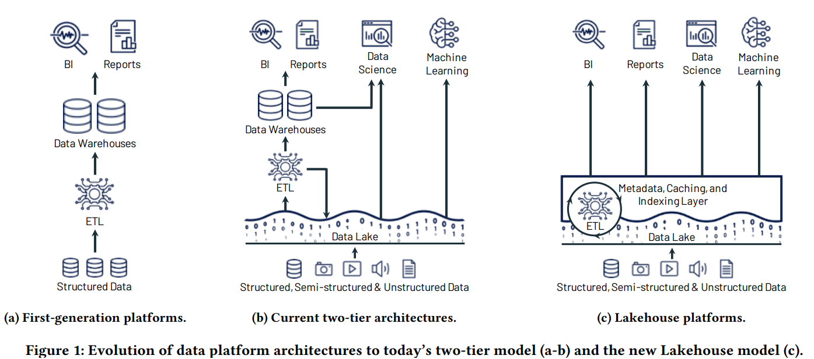
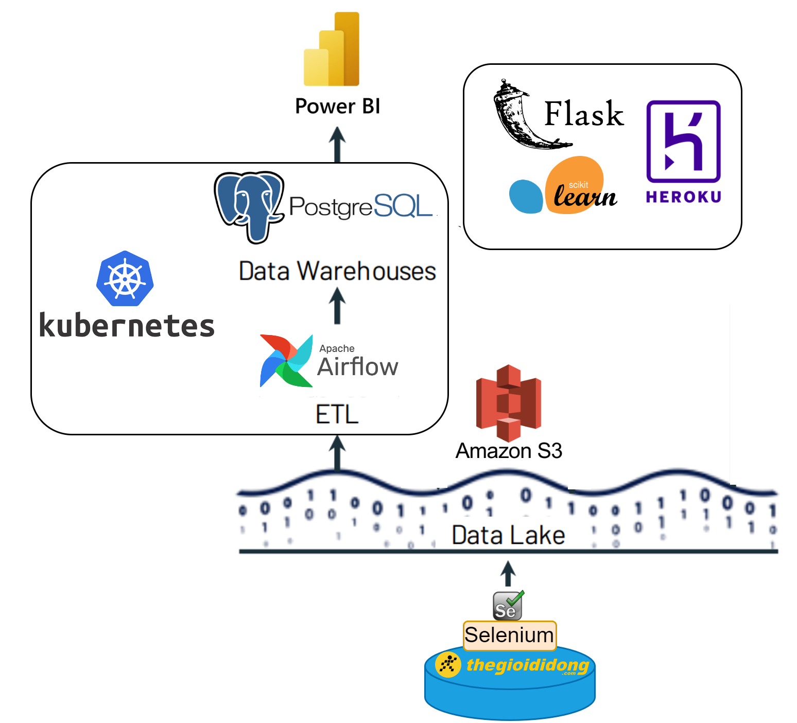
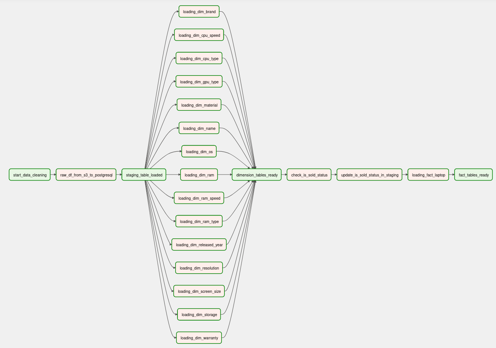

# Laptops price analysis and prediction on thegioididong.com

## **Overview**

In this project, we collect, preprocess and analyze the the price of second-hand laptops on [thegioididong.com](https://www.thegioididong.com/may-doi-tra/laptop). We also build a simple model to predict the price of a used laptop based on our deduced important features. The deployment of the model is at [https://tgdd-laptop-price-prediction.herokuapp.com/](https://tgdd-laptop-price-prediction.herokuapp.com/) (it’s down)

1. Scrape all laptops’ features on [thegioididong.com](https://www.thegioididong.com/may-doi-tra/laptop) (11:35, 28/10/2021). 
2. Data cleansing on the raw dataset 
3. Transforming features based on the original ones 
4. Performing EDA on the tidy dataset 
5. Build a model to predict the second-hand prices 
6. Deploy the model on a cloud platform.

Our dataset contains 1234 rows and 35 features. After analyzing, we found that the most important features consist of brand, material, cpu_type, gpu_type, ram, has_touchscreen, weight, ppi. Our best model (Ridge Regression with 5th polonomial degree) achieves R2 score of 0.775 on the test set.

## A little confession 😁

When I first started doing this project, I knew nothing about Data Engineering concepts (data warehouse, data lake, ETL pipelines,…). And his is how I naively executed the project back then🤔:

- No data storage. Just a stream of data flowing from task to task. No historical data was captured for further analysis.
- Each task was named by its run order so that I can run the files respectively to get the desired output.
- Each task was run in a non-distributed fashion
- No scaling
- No easy way to debug
- …

I think: “Man, you can’t put this ancient thing on your resume. Either upgrading it or hiding it completely on your profile.”

I chose the first solution since I didn’t have any attractive projects at that time.

I was highly motivated when I came across this awesome [post](https://www.sspaeti.com/blog/data-engineering-project-in-twenty-minutes/#ingesting-data-warehouse-for-low-latency--apache-druid).

I love reasoning about every decision made to the system so I enjoyed (and learned) his post a lot.

Based on his ideas and the core concepts in the book [Fundamentals of Data Engineering](https://www.amazon.com/Fundamentals-Data-Engineering-Robust-Systems/dp/1098108302) , I upgraded this project by the following steps:

1. Design the architecture.
2. Choose the tools.
3. Migrate the naive workflow to the new system.

And the below sections are how I did it.

## **Architecture**

According to this [paper](https://www.cidrdb.org/cidr2021/papers/cidr2021_paper17.pdf), there are 3 widely-used architecture for data platforms.

Despite the complexity problem mentioned in the paper, I purposely chose the two-tier data architecture (data lake + warehouse) because I want to get hands-on experience in as many popular data tools as possible.

With the extra complexity of connecting data lake and data warehouse, I hoped I could painfully feel what the authors had presented 😂.

## Tools

A picture is worth a thousand words. Here are the tools I picked for this project:

### Data lake → MinIO

At first, I was going to build a data system that completely fits into any local system. So I chose MinIO as it fitted my preference. But as I progressed, there was an error in which I couldn’t create a new bucket. So I had to use S3, which has the same API interface as MinIO. The setting up and migrating parts were easy.

### Data warehouse → PostgreSQL

I could have used ‘actual’ data warehouse, but chose PostgreSQL because I haven’t had much experience in traditional databases. Moreover, PostgreSQL is the default db for Airflow so I thought I could benefit from learning it.

### ETL tool → Airflow

Airflow is my first option because it’s virtually the most popular tool for building ETL pipelines. (Dagster or Mage is also rising)

### BI tool → PowerBI

(todo)

### Orchestration (for recovery and scaling) → Kubernetes

I had experience in Kubernetes before and its capacity is unimaginable (I was able to train YoloV5 model distributedly and gain ~ x2 training speed. Check here)

## Workflow

### 0. Setting up

I deployed a K8s cluster using `kind` and `docker` on my Ubuntu OS wraped in VirtualBox. After doing this project, I feel like my laptop’s lifespan has shortened by a huge margin😂

I also installed the Kubernetes Dashboard for better resource management and troubleshooting.

Then I deployed Airflow and PosgreSQL on K8s pods.

I had to make sure Airflow worker can access the databases residing on the PostgreSQL server in different pods. So I use the concepts of port-forwarding. I know there are better ways to do so. Check [here](https://github.com/quangdaist01/Real-time-people-counting-system-on-AWS-and-Confluent-Cloud).

Adding the DAG files to the Airflow server on K8s was hard. It took me a while to use git-sync - a "sidecar" container in Kubernetes that helped me pull the DAGs files down from a repository (GitHub, in my case) so that I could run them on Airflow.

The default Airflow [image](https://hub.docker.com/r/apache/airflow) on DockerHub doesn’t contain enough packages required in this project so I had to build one manually. Fortunately, `kind` supports loading images into my cluster. So I didn’t have to push it to DockerHub and pull it back onto the cluster, which should be a long, boring task.

1. Install `docker`
1. Install `kind`
1. Install `helm`
1. Install `kubectl`
1. Install Kubernetes Dashboard
1. Deploy Airflow on K8s
1. Deploy PostgreSQL on K8s
1. Create PostgreSQL in Airflow
1. Enable git-sync in Airflow
1. Build custom Airflow image for additional packages

### 1. Scrape all laptops’ features on [thegioididong.com](https://www.thegioididong.com/may-doi-tra/laptop)

The main page had changed a lot in the last 2 years, so I had to update almost all CSS selectors in the code. I didn’t scrape the id of each product back then so I added one in the new script. Each second-hand laptop is now associated with a unique id.

Then I manually uploaded the data on S3.

Note: Besides collecting on thegioididong.com, we also scraped the laptops from some other websites. They can be used for further data integration in the future:

- [dienmayxanh.com](dienmayxanh.com) (new laptops): 144 rows, 31 features
- [tiki.vn](tiki.vn) (new laptops): 104 rows, 41 features
- [fptshop.com.vn](fptshop.com.vn) (new laptops): 144 rows, 67 features
- [fptshop.com.vn](fptshop.com.vn) (second-hand laptops): 28 rows, 69 features
- [gearvn.com](gearvn.com) (new laptops): 96 rows, 41 features

### 2. Clean & transform data

I created a DAG file containing these Tasks:

1. Load the zip file from an S3 bucket into a dataframe
2. Rename columns, perform data wrangling
3. Load the dataframe into a staging table in PosgreSQL
    
    Make sure the Airflow server can connect to the PostgreSQL server
    
4. Load the data in the staging table into fact and dimension tables in PosgreSQL
    
    **Dimensional modelling**:
    
    - I split the raw table into fact and dimension tables.
    - As the fact table contains foreign key constraints to the dimension tables, the loading process was like this: `Staging → Dimension tables → Fact table`
    
    **Change Data Capture**: 
    
    - I make sure that each dimensional table only contains unique values. In other words, loading the same data to dimension tables won’t result in duplicated rows.
    - I added a column `is_sold` in the fact table to show the selling status of the second-hand laptops. New laptops coming into the fact table for the first time will have `is_sold` = `false`. If a laptop doesn’t appear in the subsequent scraped data (meaning it’s sold and removed from the page), `is_sold` will change from  `false` → `true`. Sounds magical 😮?
5. Perform data integrity check (optional)

Here is the DAG graph:

### 3. Analyze data

(unchanged)

To explore the key features that affect the price of laptops, I leveraged 2 approaches:

1. Qualitative: Perform EDA using `matplotlib` and related libraries
2. Quantitative: Use statistical methods such as ANOVA, calculating correlation coefficients, etc.

### 4. Build machine learning models

(unchanged)

I used the features from previous steps to predict the second-hand prices. The regression models are trained using `scikit-learn` package. We trained multiple models and picked the best one based on R square metrics (after the presentation, I figured out using Adjusted R square was better).

### 5. Deploy the model on a cloud platform

(unchanged)

We built a simple webpage using `Flask` (a bit of knowledge of HTML, CSS and JavaScript were also required) and deployed the application on Heroku.

## **Challenges and Lessons Learned**

- Setting up the whole system is painful. Basic knowledge and skills of the tools are strongly required to make sure the components are connected properly and can communicate with other parts. → SaaS comes to the rescue!
- Splitting jobs and structuring Tasks in the DAGs requires experience.
- Implementing dimensional modeling and change data capture (CDC) are only useful and fun with clear business requirements.
- Writing efficient SQL queries is important.
- …
- If you get stuck, go for a walk/get some breathing exercises/just sleep.

Thank you for reading!

I hope you have a good day🤗
